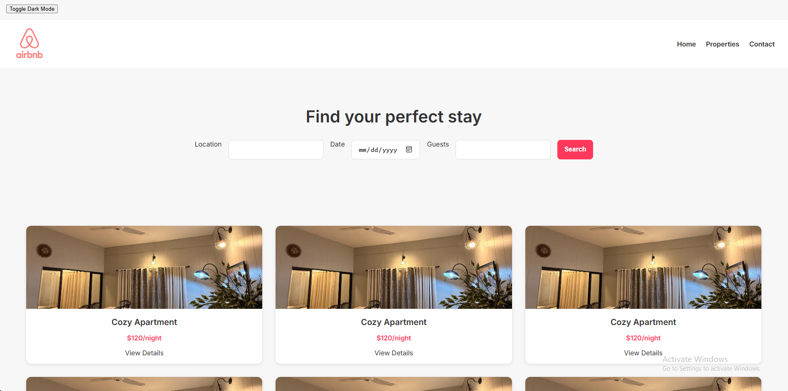

# Airbnb Landing Page Clone

A simple one‑page clone of the Airbnb landing page built with **HTML, CSS, and JavaScript**.  
This project demonstrates responsive design, clean layout, and basic interactivity.

---

## 📸 Screenshot



---

## ✨ Features

- Responsive layout using **Flexbox** and **CSS Grid**
- **Dark mode toggle** for improved user experience
- **Search bar validation** (location, date, guests)
- Hover effects on property cards
- Semantic HTML structure for accessibility

---

## 🚀 Live Demo

[View Project on Vercel](https://airbnb-clone-five-phi.vercel.app/)

---

## 🛠 Tech Stack

- **HTML5** for structure
- **CSS3** (Flexbox, Grid, Media Queries) for styling
- **JavaScript (ES6)** for interactivity
- **Git/GitHub** for version control
- **Vercel** for deployment

---

## 📂 Project Structure

airbnb-clone/
│── index.html
│── style.css
│── script.js
└── assets/
└── images, icons, screenshot.png

## ⚡ How to Run Locally

1. Clone the repo:
   ```bash
   git clone https://github.com/Momna533/airbnb-clone.git
   Open index.html in your browser.
   ```

Explore features (dark mode toggle, search validation).

📌 Future Improvements
Add more property cards dynamically with JS

Integrate date picker for search bar

Improve accessibility with ARIA labels

👩‍💻 Author
Momna Ijaz  
Frontend Developer | Responsive Websites | Clean CSS & JS
[LinkedIn](www.linkedin.com/in/momna-ijaz-951760398) | [Portfolio](https://portfolio-0-kappa.vercel.app/)
